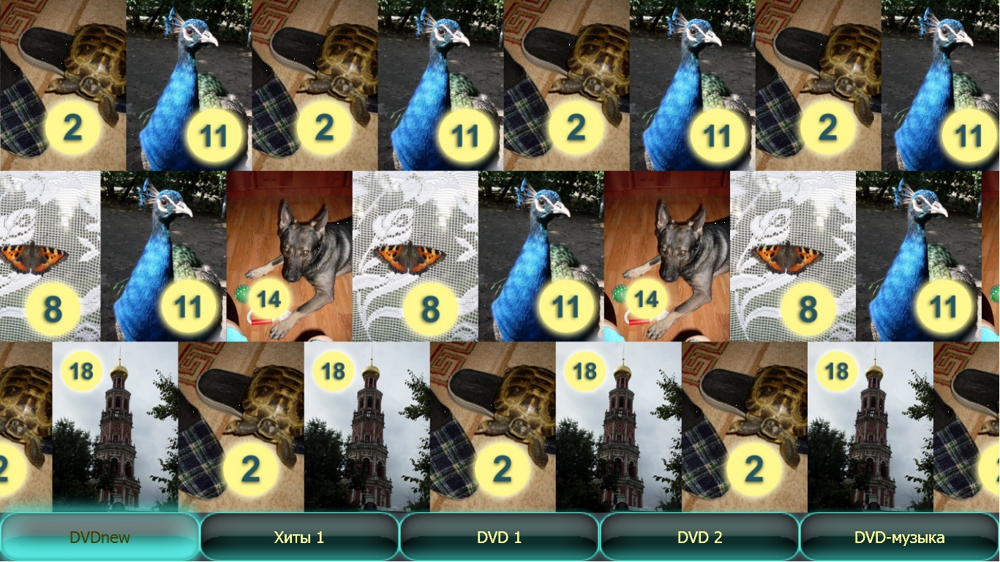
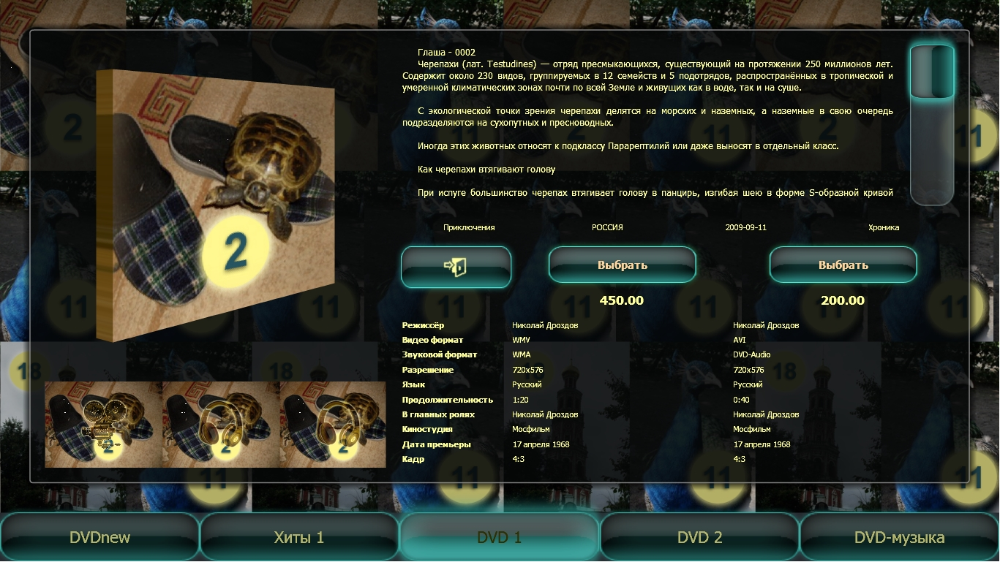
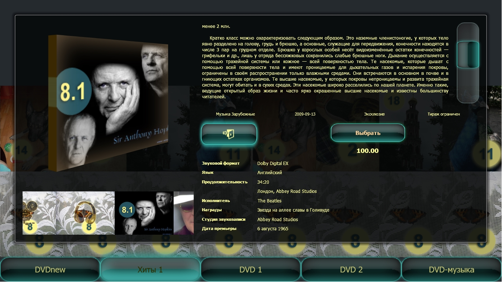
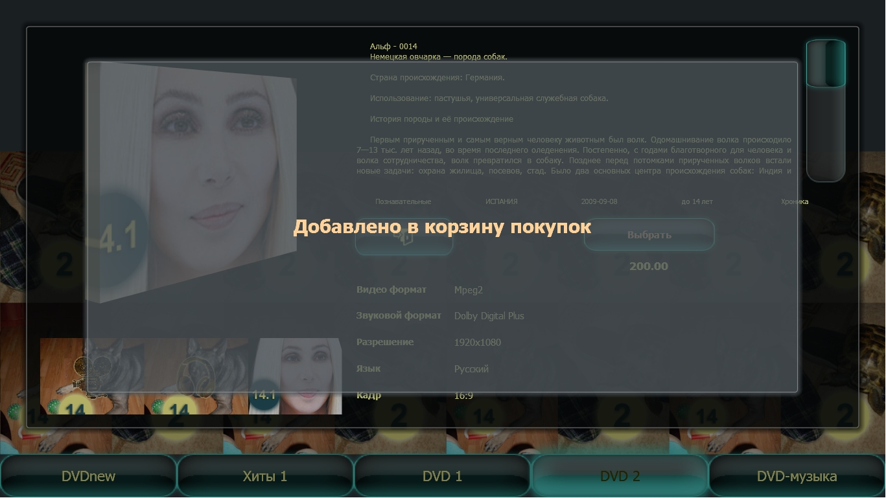
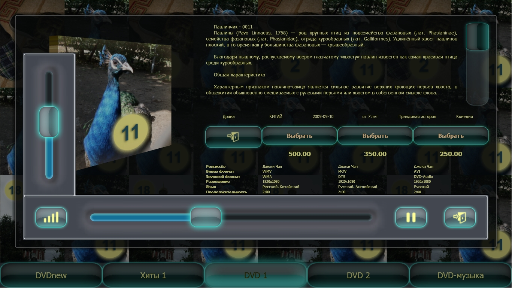
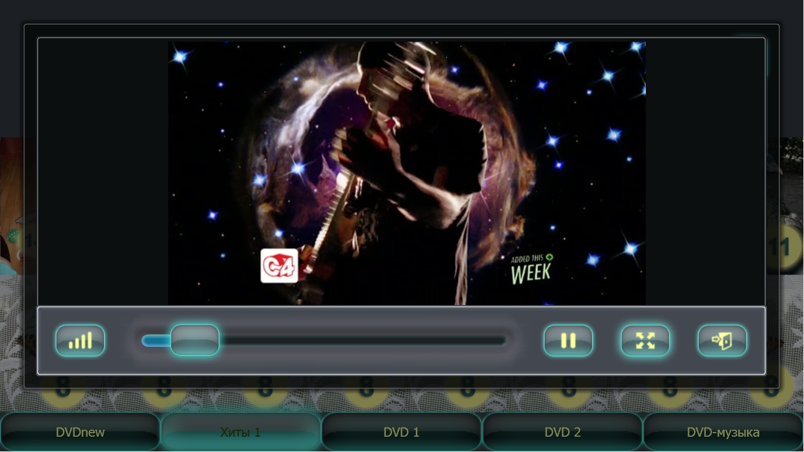
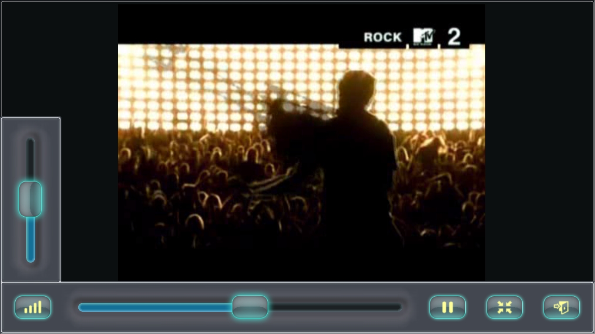

# Автоматизированная интерактивная система продажи мультимедийной продукции "Рабочий стол покупателя" (CustomerDesktop)

## Средства разработки
- **Среда разработки**: Adobe Flash Professional CS3 (клиентское приложение).
- **Платформа**: Microsoft Framework 4.0 (медиа-плеер).
- **Библиотека**: DirectX (медиа-плеер).
- **Язык программирования**:
	- ActionScript 3.0 (клиентское приложение);
	- SQL (база данных);
	- PHP 5 и XML (взаимодействие базы данных, клиентского приложения и медиа-плеера);
	- C# (медиа-плеер).
- **СУБД**: MySQL (база данных).
- **Операционная система**: Windows XP, Windows 7.
- **Аппаратная реализация**: персональный компьютер M/B AsRock 775 chipset, proc Pent.Dual-Core 2.2ГГц ОЗУ 2Гб, видео встроенное GMA3100, видеомонитор с сенсорной панелью формата (Ш/В) 102/57.5см (46”,16/9), рабочее разрешение 1920х1080. Программа без перенастройки работает с другими стандартными разрешениями.

## Описание программы
Программа "Рабочий стол покупателя" подготовлена для продажи мультимедийной продукции и предоставляет следующие возможности:
- выбор товаров по категориям;
- просмотр информации о разновидностях товара;
- просмотр слайдов, видео- и аудиофрагментов.

## Статус проекта
Проект завершён.

## Контакты
Котова Екатерина Александровна,
e-mail: katekotova_86@mail.ru